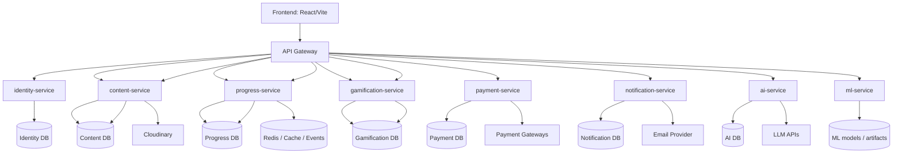
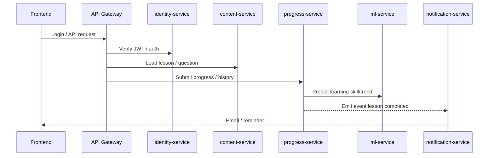

# UIFIVE Microservices Map

Tài liệu này mô tả cách tách hệ thống UIFIVE từ backend hiện tại sang kiến trúc microservices theo đúng các domain đang có trong codebase.

## 1. Hiện trạng

Repo hiện tại đang ở trạng thái:

- `Frontend/`: React + Vite
- `GatewayService/`: API Gateway công khai cho toàn hệ thống
- `IdentityService/`: service riêng cho auth, đăng ký, đăng nhập, OAuth2
- `PaymentService/`: service riêng cho payment/checkout/webhook
- `GamificationService/`: service riêng cho shop items, inventory, leaderboards
- `ContentService/`: service riêng cho grade/unit/section/lesson core, question bank và review/test
- `ProgressService/`: service riêng cho progress / lesson completion, learning analysis, user question history và activity calendar
- `AIService/`: service riêng cho writing/speaking evaluation và personalized questions
- `MLService/`: FastAPI service riêng cho dự đoán học tập
- `NotificationService/`: Spring Boot service riêng cho scheduler và email notification

Nói ngắn gọn, hệ thống hiện đã tách được `identity-service`, `payment-service`, `gamification-service`, `content-service`, `progress-service`, `notification-service`, `ai-service` và `ml-service`; phần backend monolith cũ đã được gỡ bỏ, frontend đi qua gateway và các service gọi nhau qua Feign hoặc internal HTTP endpoints.

## 2. Sơ đồ tổng quan

## 3. Mapping từ code hiện tại sang service mục tiêu

| Service mục tiêu | Code hiện tại liên quan | Trách nhiệm |
| --- | --- | --- |
| `identity-service` | `AuthController`, `UserController`, `AuthService`, `JwtService`, `SecurityConfig`, `CustomOAuth2UserService`, `OAuth2LoginSuccessHandler`, `OAuth2LoginFailureHandler`, `EmailService` | Đăng ký, đăng nhập, OAuth2, JWT, profile, verify email |
| `content-service` | `GradeController`, `UnitController`, `SectionController`, `LessonController`, `QuestionController`, `QuestionGroupController`, `QuestionOptionController`, `SemesterTestController`, `GroupReviewController`, `UnitReviewController`, `ContentDeletionService` | Unit/section/lesson, question bank, review/test content, học liệu |
| `progress-service` | `UserLessonProgressController`, `UserQuestionHistoryController`, `LearningProgressService`, `UserActivityService`, `LearningAnalysisService` | Tiến độ học, lịch sử làm bài, activity calendar, phân tích học tập |
| `gamification-service` | `LeaderboardController`, `ShopItemController`, `LeaderboardService`, `ShopItemService`, `UserItem` | EXP, coin, leaderboard, shop items, inventory |
| `payment-service` | `PaymentController`, `PaymentService`, `payment/gateway/*`, `PaymentOffer`, `PaymentTransaction`, `PaymentStatus`, `PaymentProvider` | VIP/Premium, checkout, webhook, VNPAY/Momo/bank QR |
| `gamification-service` | `LeaderboardController`, `ShopItemController`, `LeaderboardService`, `ShopItemService`, `UserItem` | EXP, coin, leaderboard, shop items, inventory |
| `content-service` | `GradeController`, `UnitController`, `SectionController`, `LessonController`, `GradeService`, `UnitService`, `SectionService`, `LessonService` | grade/unit/section/lesson core |
| `progress-service` | `UserLessonProgressController`, `LearningProgressService`, `UserLessonProgress`, `UserLessonProgressRepo` | lesson completion, unit/section progress |
| `ai-service` | `AIController`, `AiGenerationService`, `EssayService`, `SpeakingService`, `AISpeakingEvaluation`, `AIWritingEvaluation` | Sinh nội dung bằng LLM, chấm speaking/writing |
| `ml-service` | `MLPredictionService`, thư mục `MLService/` | Dự đoán `strong_skill`, `weak_skill`, `trend_label` |
| `notification-service` | `NotificationService/` | Cron jobs, nhắc streak, nhắc VIP, gửi email |

### 3.1. Audit đầy đủ theo controller

| File | Domain chính | Domain phụ | Nên để ở service nào |
| --- | --- | --- | --- |
| `AIController` | ai | essay, speaking | `ai-service` |
| `AuthController` | identity / authentication | security, session cookie | `identity-service` |
| `GradeController` | content / curriculum | admin CRUD | `content-service` |
| `GroupReviewController` | content / review | user linkage | `content-service` |
| `HelloController` | shared / health check | smoke test | `platform/shared` |
| `LeaderboardController` | gamification / ranking | exp, coin | `gamification-service` |
| `LessonController` | content / lesson | review creation | `content-service` |
| `PaymentController` | payment / checkout | webhook, vip flow | `payment-service` |
| `QuestionController` | content / assessment | cloudinary upload | `content-service` |
| `QuestionGroupController` | content / assessment | cloudinary upload | `content-service` |
| `QuestionOptionController` | content / assessment | question option data | `content-service` |
| `SectionController` | content / curriculum | admin CRUD | `content-service` |
| `SemesterTestController` | content / assessment | exam management | `content-service` |
| `ShopItemController` | gamification / shop | inventory, equip, skip item | `gamification-service` |
| `UnitController` | content / curriculum | admin CRUD | `content-service` |
| `UnitReviewController` | content / review | user linkage | `content-service` |
| `UserController` | identity / user profile | password change, activity | `identity-service` |
| `UserLessonProgressController` | progress / lesson tracking | user linkage | `progress-service` |
| `UserQuestionHistoryController` | progress / question history | user linkage | `progress-service` |

### 3.2. Audit đầy đủ theo service

| File | Domain chính | Domain phụ | Nên để ở service nào |
| --- | --- | --- | --- |
| `AiGenerationService` | ai / generation | LLM APIs | `ai-service` |
| `AuthService` | identity / authentication | jwt, verify email | `identity-service` |
| `CloudinaryService` | platform / media storage | upload files | `shared/platform` hoặc adapter riêng từng service |
| `ContentDeletionService` | content / cleanup | orphan data cleanup | `content-service` |
| `CustomOAuth2UserService` | identity / OAuth2 | google login | `identity-service` |
| `EmailService` | notification / email | verify email, notifications | `identity-service` hoặc `notification-service` |
| `EssayService` | ai / writing evaluation | cloudinary, image input | `ai-service` |
| `GradeService` | content / curriculum | admin CRUD | `content-service` |
| `GroupReviewService` | content / review | user linkage | `content-service` |
| `JwtService` | identity / token | auth claims | `identity-service` |
| `LeaderboardService` | gamification / ranking | user stats | `gamification-service` |
| `LearningAnalysisService` | progress / analysis | ml result storage | `progress-service` |
| `LearningProgressService` | progress / lesson tracking | ml prediction | `progress-service` |
| `LessonService` | content / lesson | deletion, user linkage | `content-service` |
| `MLPredictionService` | ml / prediction | progress analysis storage | `ml-service` |
| `NotificationService` | notification / scheduler | email, cron jobs | `notification-service` |
| `PaymentService` | payment / transaction | user vip update, gateways | `payment-service` |
| `PersonalizedPracticeService` | ai / personalized question generation | content, progress, user history | `ai-service` |
| `QuestionGroupService` | content / assessment | file upload | `content-service` |
| `QuestionOptionService` | content / assessment | option CRUD | `content-service` |
| `QuestionService` | content / assessment | cloudinary, user linkage | `content-service` |
| `SectionService` | content / curriculum | admin CRUD | `content-service` |
| `SemesterTestService` | content / assessment | exam management | `content-service` |
| `ShopItemService` | gamification / shop | cloudinary, user item, notification | `gamification-service` |
| `SpeakingService` | ai / speaking evaluation | progress, cloudinary, user | `ai-service` |
| `StudentFeatureService` | ml / feature engineering | progress, user history | `ml-service` |
| `UnitReviewService` | content / review | user linkage | `content-service` |
| `UnitService` | content / curriculum | admin CRUD | `content-service` |
| `UserActivityService` | progress / activity calendar | streak, calendar stats | `progress-service` |
| `UserQuestionHistoryService` | progress / question history | user linkage | `progress-service` |
| `UserService` | identity / user management | password, email, streak | `identity-service` |

### 3.3. Hạ tầng, mapper và repo theo nhóm

| Nhóm | File liên quan | Service mục tiêu |
| --- | --- | --- |
| Security / auth infra | `SecurityConfig`, `JwtAuthenticationFilter`, `AuthCookieUtil`, `PasswordConfig`, `OAuth2LoginSuccessHandler`, `OAuth2LoginFailureHandler`, `CloudinaryConfig` | `identity-service` hoặc `shared/platform` |
| API / app config | `OpenApiConfig`, `RedisCacheConfig`, `RestClientConfig` | `shared/platform` |
| Core exception | `AppException`, `ErrorCode`, `GlobalException` | `shared/core` |
| Content mappers | `GradeMapper`, `LessonMapper`, `QuestionMapper`, `QuestionGroupMapper`, `QuestionOptionMapper`, `SectionMapper`, `SemesterTestMapper`, `UnitMapper`, `GroupReviewMapper`, `UnitReviewMapper` | `content-service` |
| Identity mappers | `UserMapper` | `identity-service` |
| Progress mappers | `UserLessonProgressMapper`, `UserQuestionHistoryMapper` | `progress-service` |
| Gamification mappers | `ShopItemMapper`, `UserItemMapper` | `gamification-service` |
| Content repos | `GradeRepo`, `LessonRepo`, `QuestionRepo`, `QuestionGroupRepo`, `QuestionOptionRepo`, `SectionRepo`, `SemesterTestRepo`, `GroupReviewRepo`, `UnitRepo`, `UnitReviewRepo` | `content-service` |
| Identity repos | `UserRepo` | `identity-service` |
| Progress repos | `UserLessonProgressRepo`, `UserQuestionHistoryRepo`, `AILearningAnalysisRepo` | `progress-service` |
| Gamification repos | `ShopItemRepo`, `UserItemRepo`, `SkipUsageLogRepo` | `gamification-service` |
| Payment repos | `PaymentOfferRepo`, `PaymentTransactionRepo` | `payment-service` |
| AI repos | `AISpeakingEvaluationRepo`, `AIWritingEvalutionRepo` | `ai-service` |

## 4. Điểm phụ thuộc chéo hiện tại

Một số điểm cho thấy backend chưa phải microservices hoàn chỉnh:

- `PaymentService` phụ thuộc `UserService` để cập nhật trạng thái người dùng.
- `SpeakingService` phụ thuộc `AiGenerationService`, `LearningProgressService`, `CloudinaryService`.
- `LessonService` và `QuestionService` cùng dùng `ContentDeletionService` và `UserService`.
- `MLPredictionService` vừa lấy dữ liệu học viên vừa ghi kết quả phân tích.

Các dependency này không sai ở giai đoạn monolith, nhưng sẽ cần thay bằng REST call hoặc event bus khi tách service.

## 5. Lộ trình tách service

### Giai đoạn 1: chuẩn hóa monolith

- Gom package theo bounded context rõ ràng.
- Tách DTO và business logic dần khỏi controller.
- Chuẩn hóa interface giữa các module.

### Giai đoạn 2: thêm API Gateway

- Frontend chỉ gọi một base URL.
- Gateway route request đến từng service.
- Tập trung CORS, auth, rate limit ở một điểm.

### Giai đoạn 3: tách service ít rủi ro trước

Thứ tự khuyên dùng:

1. `notification-service`
2. `payment-service`
3. `identity-service`
4. `content-service`
5. `progress-service`
6. `gamification-service`
7. `ai-service`
8. Giữ `ml-service` riêng như hiện tại

### Giai đoạn 4: tách dữ liệu

- Mỗi service có database riêng.
- Không join chéo trực tiếp giữa các service.
- Dùng event để đồng bộ trạng thái khi cần.

### Giai đoạn 5: hoàn thiện vận hành

- Thêm logging, tracing, metrics.
- Dùng retry, circuit breaker, timeout.
- Áp dụng outbox pattern cho các event quan trọng.

## 6. Luồng nghiệp vụ đề xuất

## 7. Ghi chú triển khai

- `MLService` đã đúng hướng microservice nhất trong repo hiện tại.
- `payment-service` và `notification-service` là hai ứng viên tách sớm nhất.
- `identity-service` nên tách sau khi gateway và contract giữa các service đã ổn định.
