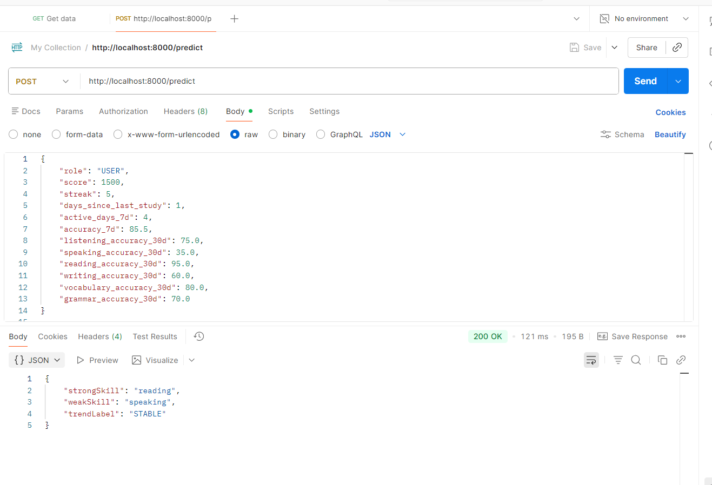

# 🚀 Dự án IE303 - Nền Tảng Học Tập Tích Hợp AI

Dự án này là một nền tảng học tập trực tuyến được xây dựng với kiến trúc Microservices, bao gồm Backend (Spring Boot), Frontend (React) và một hệ thống Trí tuệ nhân tạo (Machine Learning Service) dự đoán kỹ năng của học sinh.

---

## 🛠 Cấu Trúc Thư Mục
- `/Backend`: Mã nguồn Java Spring Boot cung cấp RESTful API và quản lý Database.
- `/Frontend`: Mã nguồn React/Vite cung cấp giao diện người dùng (UI/UX).
- `/MLService`: Mã nguồn Python (FastAPI) chứa các Model Machine Learning dự đoán điểm mạnh/yếu của học viên.

---

## ⚙️ Yêu Cầu Hệ Thống (Prerequisites)
Để chạy được toàn bộ dự án, máy tính của bạn cần cài đặt:
1. **Node.js & npm** (Để chạy React UI và lệnh concurrently)
2. **Java 21 & Maven** (Để chạy Spring Boot Backend)
3. **Python 3** (Để chạy Machine Learning FastAPI)
4. **PostgreSQL** (Hệ quản trị CSDL)

---

## 🚀 Hướng Dẫn Chạy Dự Án

### Bước 1: Cấu hình biến môi trường
Hãy đảm bảo bạn đã có file `.env` nằm trong thư mục `Backend/`. File này chứa các cấu hình quan trọng như:
- Kết nối cơ sở dữ liệu (`DB_URL`, `DB_USERNAME`, `DB_PASSWORD`)
- Chữ ký bảo mật JWT (`JWT_SECRET`)
- Cloudinary, Gemini API keys...


### Bước 2: Cài đặt môi trường và Huấn luyện mô hình AI
Trước khi khởi động AI Server, bạn cần cài đặt các thư viện Python và huấn luyện mô hình dự đoán.
Mở một cửa sổ Terminal (PowerShell) mới và chạy các lệnh sau:
```powershell
cd d:\ie303\MLService
# Khởi tạo môi trường ảo (Bắt buộc cho lần chạy đầu tiên)
python -m venv venv
.\venv\Scripts\activate
# Cài đặt các thư viện cần thiết
pip install -r requirements.txt
# Chạy script huấn luyện
python train.py
```
> 🧠 **Lưu ý:** Nếu trong thư mục `MLService/saved_models/` đã có sẵn các file `.pkl`, bạn **không cần chạy lệnh `python train.py`**, nhưng **vẫn phải chạy các lệnh cài tạo `venv` và `pip install`** ở trên cho lần đầu tiên cài đặt dự án. Khi chạy `train.py`, các file mô hình `.pkl` mới sẽ được tạo và lưu vào thư mục `MLService/saved_models/`.

### Bước 3: Khởi động hệ thống chính (Backend & Frontend)
Đầu tiên, bạn cần cài đặt các gói phụ thuộc (chỉ cần thực hiện 1 lần duy nhất). Mở Terminal tại thư mục gốc của dự án (`d:\ie303`) và chạy:
```bash
npm install
cd Frontend && npm install
cd ..
```

Sau đó, khởi động toàn bộ dự án bằng lệnh:
```bash
npm run dev
```
> 🎉 *Lệnh này sẽ tự động bật **Backend (cổng 8080)** và **Frontend (cổng 5173)***.

### Bước 4: Khởi động AI Server (Machine Learning)
Mở một cửa sổ Terminal (PowerShell) **MỚI**, di chuyển vào thư mục `MLService` và chạy file script khởi động:
```powershell
cd d:\ie303\MLService
.\start.ps1
```
> 🤖 *Máy chủ AI bằng FastAPI sẽ được khởi chạy tại **cổng 8000***. (*Lưu ý: File `start.ps1` đã được cấu hình tự động sử dụng môi trường ảo venv, nên bạn không cần gọi lệnh activate nữa*).
---

## 🧠 Tích Hợp Machine Learning (AI Insights)

Trong phiên bản mới nhất, hệ thống đã được nâng cấp với khả năng dự đoán và phân tích dữ liệu học tập thông minh sử dụng mô hình học máy **RandomForestClassifier**.

### 1. Cơ chế và Kiến trúc AI:
- **Huấn luyện mô hình (Training)**: Dữ liệu (từ `student_skill_trend_dataset_2000.csv`) được tiền xử lý và huấn luyện thông qua `train.py`. Các mô hình sau khi học xong được trích xuất thành các file `.pkl` lưu tại `saved_models/`.
- **Microservice độc lập**: AI được tách thành một service riêng bằng **FastAPI** (`app.py`), có nhiệm vụ load các models lên RAM và lắng nghe yêu cầu từ Backend.

### 2. Quy Trình Dự Đoán Bằng Machine Learning (Chi tiết):

Luồng dữ liệu từ lúc học viên hoàn thành bài học đến khi nhận được đánh giá từ AI đi qua các file mã nguồn cụ thể như sau:

**Bước 1: Ghi nhận kết quả (Frontend)**
Học viên hoàn thành bài tập (Lesson) trên trình duyệt. Frontend sẽ gọi API gửi điểm số, thời gian làm bài, số câu đúng/sai về Backend.

**Bước 2: Tính toán & Chuẩn hóa dữ liệu (Spring Boot Backend)**
File `LearningProgressService.java` tiếp nhận kết quả. Tại đây, hệ thống tính toán tiến độ (cộng dồn EXP, chuỗi ngày học) và chuẩn hóa các chỉ số thành định dạng đầu vào cho AI (tỷ lệ độ chính xác, tần suất học).

**Bước 3: Gửi dữ liệu cho AI Server (Spring Boot Backend)**
File `MLPredictionService.java` lấy dữ liệu đã chuẩn hóa, đóng gói thành chuỗi JSON và gửi một `HTTP POST Request` sang AI Server (endpoint `http://localhost:8000/predict`).
  
**Bước 4: Xử lý & Dự đoán (AI Server - FastAPI)**
Tại thư mục `MLService`, file `app.py` tiếp nhận JSON. Dữ liệu được đưa vào mô hình học máy **Random Forest** (đã được nạp từ các file `.pkl` trong `saved_models/`). Mô hình sẽ trả ra 3 dự đoán:
  🔸 **Strong Skill**: Kỹ năng tốt nhất (*VD: Listening*)
  🔸 **Weak Skill**: Kỹ năng cần trau dồi (*VD: Grammar*)
  🔸 **Learning Trend**: Xu hướng học tập (*VD: IMPROVING*)
  
**Bước 5: Lưu trữ kết quả (Spring Boot Backend)**
Kết quả trả về từ FastAPI được `MLPredictionService.java` đón nhận, cập nhật lại vào đối tượng `User` (hoặc Profile) và lưu xuống Database (PostgreSQL).
  
**Bước 6: Hiển thị giao diện (Frontend)**
Khi người dùng mở trang Profile, Frontend sẽ tải dữ liệu mới nhất và đồng bộ vào khối **AI Learning Insights**, vẽ các biểu đồ/thẻ màu sắc báo cáo tình trạng học tập.

### 3. Giao diện thân thiện (UI/UX):
Dữ liệu AI sau đó được đồng bộ lên trang **Profile** của người dùng. Hệ thống sẽ hiển thị một khối **AI Learning Insights** bằng các thẻ (Cards) rực rỡ và trực quan. Từ đó, học viên có thể nhìn vào Profile của mình để biết được điểm yếu cần khắc phục, giúp cá nhân hóa quá trình tự học một cách hiệu quả nhất!

### 4. TEST trên postman:

**Bước 1:  Cấu hình Request trên Postman**

1. Mở Postman lên.
2. Đổi phương thức (Method) từ GET sang POST.
3. Nhập URL của AI Server: `http://localhost:8000/predict`

**Bước 2: Chuẩn bị dữ liệu mẫu (JSON)**

1. Ngay bên dưới thanh URL, bạn chọn tab **Body**.
2. Chọn tiếp mục **raw**.
3. Ở góc phải của khung chọn (chỗ có chữ **Text**), bấm vào mũi tên xổ xuống và chọn **JSON**.
4. Copy đoạn mã JSON giả lập dữ liệu học tập của một học viên dưới đây và dán vào ô trống:
```json
{
    "role": "USER",
    "score": 1500,
    "streak": 5,
    "days_since_last_study": 1,
    "active_days_7d": 4,
    "accuracy_7d": 85.5,
    "listening_accuracy_30d": 75.0,
    "speaking_accuracy_30d": 35.0,
    "reading_accuracy_30d": 95.0,
    "writing_accuracy_30d": 60.0,
    "vocabulary_accuracy_30d": 80.0,
    "grammar_accuracy_30d": 70.0
}
```

**Bước 3: Gửi request**
Nhấn nút Send màu xanh. Ở khung Response (kết quả trả về) phía bên dưới, bạn sẽ nhận được một JSON phản hồi từ AI.

**Bước 4: Ảnh kết quả mô phỏng:**
