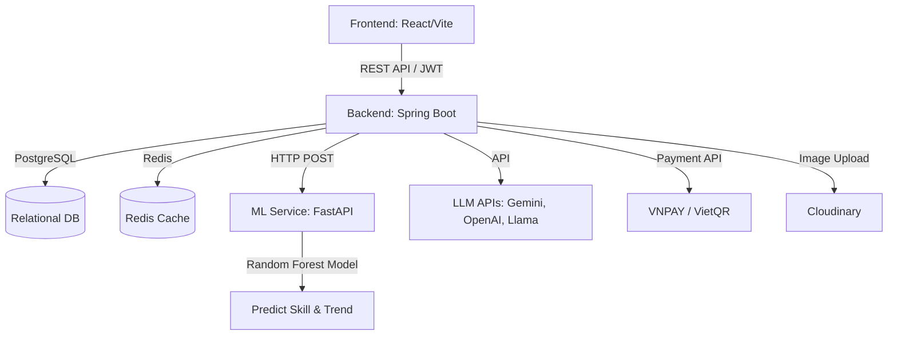

# 🚀 UIFive Learning System (IE303)

Một nền tảng học tập trực tuyến thông minh được thiết kế với kiến trúc Microservices, tích hợp Trí tuệ Nhân tạo (Generative AI) và Machine Learning để dự đoán năng lực học tập, tối ưu hóa quá trình học tập của học viên.

---

## 🌟 1. Features

- **Xác thực & Bảo mật (Authentication)**: Hỗ trợ đăng nhập truyền thống (JWT) và Google OAuth2.
- **Quản lý Học tập**: Hệ thống Unit, Section, Lesson và Question đa dạng.
- **Gamification**: Tích hợp hệ thống điểm kinh nghiệm (EXP), Coin, chuỗi ngày học (Streak), Leaderboard và Cửa hàng vật phẩm (Shop Items).
- **AI Tích hợp (Generative AI)**: Sử dụng các mô hình ngôn ngữ lớn (Gemini, Llama qua NVIDIA API, OpenAI, Anthropic) để hỗ trợ học viên.
- **Machine Learning Insights**: Phân tích dữ liệu học tập và dự đoán kỹ năng mạnh, yếu, cùng xu hướng học tập của học viên.
- **Thanh toán Trực tuyến**: Tích hợp cổng thanh toán VNPAY và VietQR cho các gói VIP/Premium.
- **Cloud Storage**: Quản lý hình ảnh và đa phương tiện bằng Cloudinary.
- **Thông báo & Lịch trình (Cron Jobs)**: Nhắc nhở chuỗi ngày học và gói VIP.

---

## 🏗️ 2. System Architecture

Hệ thống hoạt động dưới dạng Microservices giao tiếp thông qua RESTful APIs:



---

## 💻 3. Tech Stack

### Frontend

- **Framework**: React 18, TypeScript, Vite
- **Styling**: TailwindCSS, Emotion
- **UI Components**: Radix UI, Material UI, Lucide React (Icons)
- **State/Form**: React Hook Form
- **Animation/Charts**: Framer Motion, Recharts

### Backend

- **Framework**: Java 21, Spring Boot 3.4.0
- **Database/Cache**: PostgreSQL, Spring Data Redis
- **Security**: Spring Security, JWT, OAuth2 Client
- **Mapping & Utilities**: MapStruct, Lombok
- **Integrations**: JavaMailSender, Cloudinary, VNPAY

### Machine Learning

- **Framework**: Python 3, FastAPI, Uvicorn
- **Data & Model**: Pandas, Scikit-learn (RandomForestClassifier), Joblib
- **Dataset**: Dữ liệu học viên nội bộ (`student_skill_trend_dataset_2000.csv`)

---

## 📂 4. Project Structure

```txt
ie303/
├── Backend/          # Source code Java Spring Boot (REST API)
│   ├── src/          # Source code chính, Controllers, Services, Models
│   ├── Dockerfile    # Cấu hình build Docker cho backend
│   └── pom.xml       # Cấu hình Maven dependencies
├── Frontend/         # Source code React + Vite (Giao diện người dùng)
│   ├── src/          # Components, Pages, Assets
│   ├── package.json  # Cấu hình dependencies Frontend
│   └── vite.config.ts# Cấu hình Vite
├── MLService/        # Source code Python (Machine Learning & FastAPI)
│   ├── app.py        # Khởi chạy server FastAPI
│   ├── train.py      # Script huấn luyện mô hình Random Forest
│   └── saved_models/ # Chứa các file mô hình (.pkl) sau khi train
└── DEPLOYMENT.md     # Hướng dẫn CI/CD và triển khai dự án
```

---

## ⚙️ 5. Installation & Setup

### Yêu cầu hệ thống

- Node.js (v18+)
- Java 21 & Maven
- Python 3.9+
- PostgreSQL & Redis

### 5.1. Khởi chạy toàn bộ dự án bằng `concurrently` (Khuyên dùng)

Tại thư mục gốc, hệ thống đã cấu hình để chạy đồng thời Frontend và Backend:

```bash
npm install
npm run dev
```

### 5.2. Cài đặt chi tiết từng thành phần

**Frontend (Port 5173)**:

```bash
cd Frontend
npm install
npm run dev
```

**Backend (Port 8080)**:

```bash
cd Backend
./mvnw spring-boot:run
```

**Machine Learning Service (Port 8000)**:

```bash
cd MLService
# 1. Tạo môi trường ảo
python -m venv venv
# 2. Activate môi trường (Mac/Linux: source venv/bin/activate, Windows: .\venv\Scripts\activate)
source venv/bin/activate
# 3. Cài đặt dependencies
pip install -r requirements.txt
# 4. Huấn luyện mô hình (Tạo ra các file .pkl trong thư mục saved_models)
python train.py
# 5. Khởi động AI API Server
python app.py
```

---

## 🔐 6. Environment Variables

Tạo các file `.env` ở mỗi thư mục. Dưới đây là các file mẫu.

**`Backend/.env`**:

```env
PORT=8080
DB_URL=jdbc:postgresql://<host>/<dbname>
DB_USERNAME=
DB_PASSWORD=

JWT_SECRET=your_jwt_secret_key
JWT_EXPIRATION=3600000

MAIL_SMTP_USERNAME=
MAIL_SMTP_PASSWORD=

GOOGLE_CLIENT_ID=
GOOGLE_CLIENT_SECRET=

GEMINI_API_KEY=
NVIDIA_API_KEY=
OPENAI_API_KEY=
ANTHROPIC_API_KEY=

CLOUD_NAME=
API_KEY=
API_SECRET=

PAYMENT_VNPAY_TMN_CODE=
PAYMENT_VNPAY_SECRET=

ML_API_URL=http://localhost:8000/predict
FRONTEND_BASE_URL=http://localhost:5173
UPSTASH_REDIS_URL=
```

**`Frontend/.env`**:

```env
VITE_API_BASE_URL=http://localhost:8080/api
```

---

## 🔌 7. API Documentation (Backend)

Hệ thống cung cấp một loạt các RESTful endpoint. Bạn có thể truy cập Swagger UI (khi chạy backend) qua cổng 8080. Một số endpoint chính:

- `POST /api/auth/*` - Đăng ký, đăng nhập, xác thực OAuth2.
- `GET /api/users/*` - Quản lý thông tin và profile người dùng.
- `GET/POST /api/ai/*` - Giao tiếp với LLMs (Gemini, Llama) để tạo nội dung học.
- `GET/POST /api/units/*`, `/api/lessons/*` - Truy xuất bài học, lý thuyết.
- `GET/POST /api/payments/*` - Tạo giao dịch VNPAY, webhook thanh toán.
- `GET /api/leaderboards/*` - Lấy bảng xếp hạng theo EXP/Coin.

---

## 🧠 8. Machine Learning Details

Module ML được viết bằng Python/FastAPI, chịu trách nhiệm nhận dữ liệu học viên (điểm, chuỗi ngày học, tần suất, độ chính xác các kỹ năng) và trả về phân tích.

- **Mô hình**: `RandomForestClassifier` (300 estimators, max depth 12).
- **Features chính**: `score`, `streak`, `accuracy_7d`, `accuracy_30d` (chia theo listening, speaking, reading, writing, vocabulary, grammar), v.v.
- **Targets (Dự đoán)**:
  - `strong_skill`: Kỹ năng người học tốt nhất.
  - `weak_skill`: Kỹ năng người học cần cải thiện.
  - `trend_label`: Xu hướng học tập (Đang tiến bộ, đi lùi, v.v.).
- **Endpoint**: `POST /predict` (Nhận JSON và trả về 3 dự đoán).

---

## 🚀 9. Deployment

Dự án được triển khai hoàn chỉnh trên **Render** và sử dụng domain riêng:

- **Hosting Platform**: Render.
- **Frontend**: Render Static Site.
- **Backend**: Render Web Service cho Java Spring Boot.
- **ML Service**: Render Web Service .
- **Database**: PostgreSQL trên Neon.
- **Domain**: [https://uifive.io.vn/](https://uifive.io.vn/)

---

## 👥 10. Contributors

Phát triển bởi:

| STT | Họ và tên        | Vai trò            | GitHub                                        |
| --- | ---------------- | ------------------ | --------------------------------------------- |
| 1   | Huỳnh Tuấn Phi   | Backend Developer  | [GitHub](https://github.com/bincasau)         |
| 2   | Nguyễn Lý Anh Vũ | Frontend Developer | [GitHub](https://github.com/NguyenVu3105)     |
| 3   | Võ Thành Nhân    | Frontend Developer | [GitHub](https://github.com/NhanVT24)         |
| 4   | Nguyễn Cao Cường | AI/ML Engineer     | [GitHub](https://github.com/nguyencuong335)   |
| 5   | Nguyễn Quốc Đạt  | Leader             | [GitHub](https://github.com/danielnguyen0705) |

GitHub: [UIFIVE](https://github.com/danielnguyen0705/ie303)

---

## 📜 11. License

Dự án được phân phối dưới giấy phép **MIT License**. Bạn có quyền tự do sử dụng, chỉnh sửa và phân phối mã nguồn này cho mục đích học tập và thương mại.
