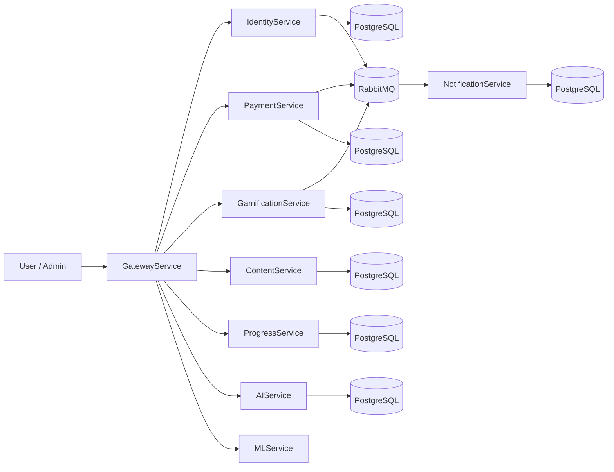

# Roadmap Docker + RabbitMQ cho UIFIVE

Tai lieu nay mo ta lo trinh chuyen doi he thong UIFIVE sang:

- `Docker` de dong goi moi truong chay va trien khai
- `RabbitMQ` de xu ly cac tac vu bat dong bo co gia tri roi rac

Tai lieu nay **khong bao gom Kubernetes**.

---

## 1. Muc tieu

### Docker

- Chay toan bo stack bang mot lenh
- Dong nhat moi truong giua cac thanh vien trong nhom
- Giam loi kieu "may toi chay duoc"
- De deploy len server hoac nen tang container

### RabbitMQ

- Tach cac tac vu khong can tra ket qua ngay khoi request chinh
- Giam phu thuoc chat giua cac service
- De retry khi service email/notification bi cham
- De mo rong ve sau neu can them consumer moi

---

## 2. Pham vi de chuyen doi

### Nen Docker hoa

- `PostgreSQL`
- `Redis`
- `RabbitMQ`
- `GatewayService`
- `IdentityService`
- `PaymentService`
- `NotificationService`
- `GamificationService`
- `ContentService`
- `ProgressService`
- `AIService`
- `MLService`
- `Frontend`

### Nen dua sang RabbitMQ

Chi nen dua cac tac vu side effect sang queue, khong nen dua toan bo API sang event.

#### Nen dua sang queue

- Gui email xac nhan dang ky tai khoan
- Thong bao khi tao shop item moi
- Thong bao khi thanh toan thanh cong

#### Nen giu HTTP dong bo

- Dang nhap
- Dang ky
- Lay profile
- Lay lesson/question
- Checkout
- Lay leaderboard
- Cac API frontend can phan hoi ngay

---

## 3. Tinh trang hien tai

He thong hien tai da co:

- Microservices tach rieng
- Giao tiep chu yeu qua HTTP/Feign
- Redis cache cho mot so service
- Scheduled jobs cho streak/VIP reminder
- NotificationService da co luong gui email

Dieu nay co nghia la:

- `Docker` rat phu hop de dong goi moi truong
- `RabbitMQ` chi nen them vao dung cho cac luong can bat dong bo
- Khong can doi sang architecture event-driven toan bo

---

## 4. Lo trinh chuyen doi

## Giai doan 1: Docker hoa

### Buoc 1. Tao Dockerfile cho tung service

Moi service Java nen co `Dockerfile` rieng:

- dung image base Java 21
- copy source code
- build bang Maven
- chay file jar

`Frontend` can Dockerfile rieng:

- cai dependencies
- build Vite
- serve static files

`MLService` can Dockerfile rieng:

- cai Python dependencies
- dam bao `saved_models/` co san
- chay `uvicorn`

### Buoc 2. Tao `docker-compose.yml`

`docker-compose.yml` nen gom:

- `postgres`
- `redis`
- `rabbitmq`
- cac service backend
- `frontend`
- `ml-service`

### Buoc 3. Dung ten service noi bo

Trong container network, cac service nen goi nhau qua ten container, khong dung `localhost`.

Vi du:

- `identity-service` goi `notification-service`
- `gamification-service` goi `notification-service`
- `progress-service` goi `ml-service`
- `gateway-service` route sang cac service con lai

### Buoc 4. Chuan hoa env

Can bo sung cac bien moi truong cho Docker:

- `DB_URL`
- `DB_USERNAME`
- `DB_PASSWORD`
- `REDIS_URL`
- `RABBITMQ_HOST`
- `RABBITMQ_PORT`
- `RABBITMQ_USERNAME`
- `RABBITMQ_PASSWORD`
- `PORT`

### Tac dung cua giai doan 1

- Chay duoc toan bo stack bang mot lenh
- Dong nhat moi truong local
- De demo va debug
- De test integration nhanh hon

---

## Giai doan 2: Them RabbitMQ

### Chon muc tieu event

Chi nen bat dau voi 3 event co gia tri ro rang:

1. `user.verification_requested`
2. `shop_item.created`
3. `payment.completed`

### 2.1. Event `user.verification_requested`

#### Noi phat sinh

- `IdentityService` khi tao user moi

#### Noi nhan

- `NotificationService`

#### Tac dung

- Gui email xac nhan dang ky
- IdentityService khong can goi HTTP truc tiep sang NotificationService

#### Doi song luong

- User register
- Tao verification token
- Publish event len RabbitMQ
- NotificationService consume event
- Gui email

### 2.2. Event `shop_item.created`

#### Noi phat sinh

- `GamificationService` khi admin tao shop item moi

#### Noi nhan

- `NotificationService`

#### Tac dung

- Gui thong bao cho nguoi dung
- Giam phu thuoc truoc day vao Feign call dong bo

#### Doi song luong

- Admin tao item
- GamificationService luu DB
- Publish event
- NotificationService consume event
- Gui email announce

### 2.3. Event `payment.completed`

#### Noi phat sinh

- `PaymentService` khi giao dich chuyen sang `SUCCESS`

#### Noi nhan

- `NotificationService`

#### Tac dung

- Gui email xac nhan thanh toan
- Co the mo rong thanh thong bao in-app sau nay

#### Doi song luong

- User thanh toan
- PaymentService cap nhat transaction
- Publish event
- NotificationService consume event
- Gui email

---

## 5. Cai gi nen giu lai

Khong nen dua nhung phan nay sang RabbitMQ ngay:

- `@Scheduled` cho streak reminder
- `@Scheduled` cho VIP reminder
- API CRUD thong thuong
- Checkout va webhook payment
- Auth/login/register response

Ly do:

- Cac luong nay can phan hoi ngay
- Khong can event phuc tap hon muc can thiet
- De debug va test don gian hon

---

## 6. Lich trinh de xuat

### Sprint 1

- Tao `Dockerfile` cho moi service
- Tao `docker-compose.yml`
- Chuan hoa bien moi truong

### Sprint 2

- Them RabbitMQ vao compose
- Them dependency AMQP cho service can publish/consume
- Tao event contract JSON

### Sprint 3

- Chuyen `verification email` sang queue
- Chuyen `shop item announcement` sang queue
- Chuyen `payment completed` sang queue
- Giu REST fallback tam thoi

### Sprint 4

- Don dep code Feign call cu
- Hoan thien retry/backoff cho consumer
- Them dead-letter queue neu can

---

## 7. Cach trien khai cu the trong repo nay

### File se can them

- `docker-compose.yml`
- `Dockerfile` cho tung service
- `.env.docker` hoac bien trong compose
- cau hinh RabbitMQ cho cac service
- class event request/consumer/publisher

### File se can sua

- `IdentityService/src/main/java/.../UserService.java`
- `IdentityService/src/main/java/.../NotificationClient.java`
- `GamificationService/src/main/java/.../ShopItemService.java`
- `GamificationService/src/main/java/.../NotificationClient.java`
- `PaymentService/src/main/java/.../PaymentService.java`
- `NotificationService/src/main/java/.../NotificationService.java`
- `NotificationService/src/main/java/.../NotificationController.java`
- `application.properties` hoac `application.yml` cua cac service

---

## 8. Kien truc de nghi

### Docker layer

- Moi service co image rieng
- Moi service chay tren 1 container
- Moi dependency chung chay trong container rieng

### RabbitMQ layer

- Mot exchange chung cho notification events
- Moi event la mot message JSON
- NotificationService la consumer chinh
- Co the them retry va dead-letter queue sau

### Flow de nghi

---

## 9. Ket luan

- `Docker`: nen lam truoc
- `RabbitMQ`: nen them cho notification-related side effects
- `Kubernetes`: khong can lam trong giai doan nay

Neu muc tieu la on dinh codebase va de chay local/deploy, thi roadmap hop ly nhat la:

1. Docker
2. RabbitMQ cho notification flow
3. Giu scheduling cho streak/VIP

